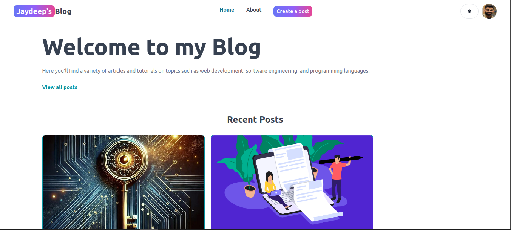
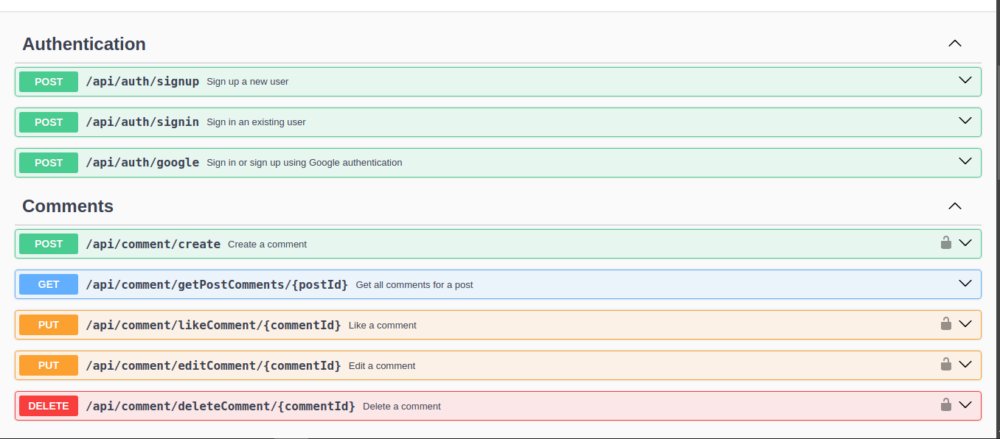

---

# MERN Blog Application


A full-stack blog application built using the **MERN stack** (MongoDB, Express.js, React.js, Node.js). This application allows users to create, update, delete, and manage blog posts and comments. It includes authentication (JWT and Google OAuth), a like/dislike feature, and an admin panel for managing content.

---

## Home Page


## Swagger API Documentation


## Features

- **User Authentication**: Sign up, sign in, and social login with Google OAuth.
- **Admin Panel**: Admin users can manage posts and comments.
- **CRUD Operations**: Create, read, update, and delete blog posts and comments.
- **Like/Dislike System**: Users can like or dislike posts, and admins can view detailed statistics of likes/dislikes.
- **Commenting System**: Users can comment on blog posts with the ability to like comments.
- **Responsive Design**: Built with modern UI components for a seamless user experience across devices.
- **Fully Documented API**: All API endpoints are documented using Swagger for easy interaction with the backend.

---

## Tech Stack

**Frontend**:
- React.js
- Axios (for HTTP requests)
- Flowbite (UI components)

**Backend**:
- Node.js
- Express.js
- MongoDB (with Mongoose)
- JWT (JSON Web Token) for authentication
- Google OAuth for social login
- Swagger for API documentation

**Other Tools**:
- ESLint for code linting
- Nodemon for development

---

## Table of Contents

- [Features](#features)
- [Tech Stack](#tech-stack)
- [Installation](#installation)
- [API Documentation](#api-documentation)
- [Usage](#usage)
- [Environment Variables](#environment-variables)
- [Contributing](#contributing)
- [License](#license)

---

## Installation

### Prerequisites

Before you begin, ensure you have the following installed on your system:
- Node.js (>=14.x)
- MongoDB (Local or Cloud, like MongoDB Atlas)
- Git

### Clone the repository

```bash
git clone https://github.com/jaydeep-pipaliya/MERN-Blog-Website.git
cd MERN-Blog-Website
```

### Install Dependencies

#### Backend
```bash
npm install
```

#### Frontend
```bash
cd client
npm install
```

---

## API Documentation

The API is fully documented using **Swagger**. You can access the API documentation by navigating to:

```
http://localhost:3000/api-docs
```

This provides a clear and interactive interface for all available API endpoints, including request/response formats, parameters, and expected status codes.

---

## Usage

### Running the Application

#### Backend
To start the Node.js/Express server (Backend):
```bash
npm run dev
```
The backend server will be running at: `http://localhost:3000`

#### Frontend
To start the React development server (Frontend):
```bash
cd client
npm run dev
```
The frontend will be running at: `http://localhost:5173`

### Admin Access

Admin users have access to extra features, such as:
- Creating blog posts
- Deleting/Editing any user’s posts
- Viewing details of users who liked or disliked a post

---

## Environment Variables

To run this project, you will need to set up the following environment variables in your `.env` file:

#### Backend `.env`:

```plaintext
MONGO=mongodb+srv://<username>:<password>@cluster0.mongodb.net/blog-app?retryWrites=true&w=majority
JWT_SECRET=your_jwt_secret
GOOGLE_CLIENT_ID=your_google_client_id
GOOGLE_CLIENT_SECRET=your_google_client_secret
```

#### Frontend `.env`:

```plaintext
VITE_FIREBASE_API_KEY=your_firebase_api_key
VITE_GOOGLE_CLIENT_ID=your_google_client_id
```

---

## Features Overview

### Authentication
- **JWT Authentication**: Ensures secure user sessions with the use of access tokens.
- **Google OAuth**: Allows users to sign in using their Google account.

### Blog Management
- **Create, Update, Delete**: Users (with admin permissions) can create, update, and delete blog posts.
- **Like/Dislike**: Users can like or dislike blog posts and comments.
- **Comments**: Users can add comments to blog posts, with the ability to edit or delete their comments.

### Admin Panel
Admins have additional privileges to manage user-generated content, including the ability to:
- View who liked/disliked specific posts
- Delete any posts or comments

---

## Contributing

Contributions are always welcome! If you find a bug or have a suggestion for a new feature, please open an issue or submit a pull request.

To contribute:
1. Fork this repository.
2. Create a new branch (`git checkout -b feature-branch`).
3. Commit your changes (`git commit -m 'Add some feature'`).
4. Push to the branch (`git push origin feature-branch`).
5. Open a pull request.

---

## License

This project is open source and available under the [MIT License](LICENSE).

---

## Contact

For more information, feel free to reach out:

**Jaydeep Pipaliya**  
[LinkedIn](https://www.linkedin.com/in/jaydeep-pipaliya-380905217/)  
[Email: jbpipaliya71@gmail.com](mailto:jbpipaliya71@gmail.com)

---

This README provides all the necessary details to set up, run, and contribute to the project, ensuring that anyone who interacts with the repository understands the project structure and functionality. You can modify any part of it according to your specific requirements.

Let me know if you'd like further changes or additional sections!
